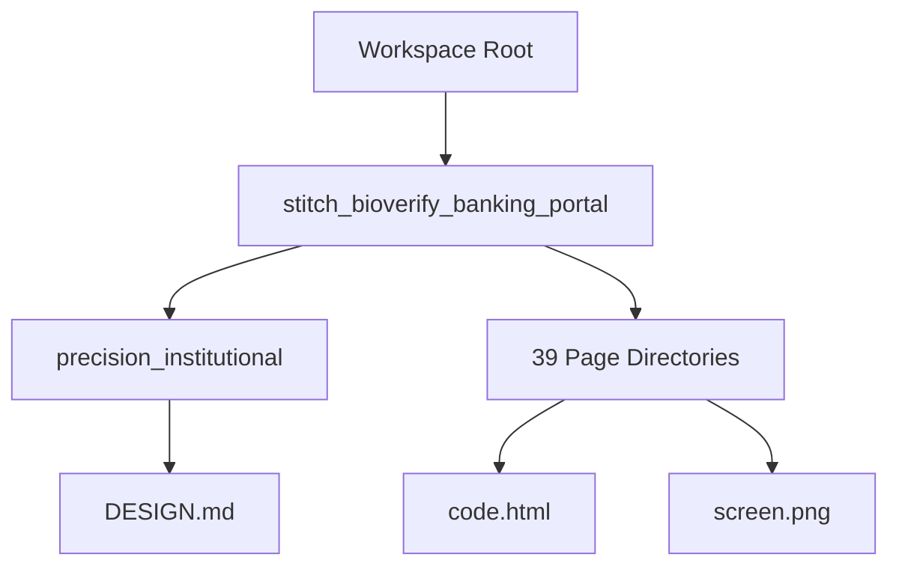

# Aegis Biometric Banking Portal - Frontend Implementation Report

This report provides a detailed analysis of the banking portal frontend generated by Google Stitch, detailing its folders, routing, reusable UI components, architecture, page inventories, placeholders, dependencies, and compile-time status.

---

## 1. Project Architecture Overview

The frontend architecture currently consists of a **flat, multi-page static mockup layout**. There is no central build framework, package configuration, or JavaScript-based single-page application (SPA) shell. 

### Architecture Characteristics:
* **Decentralized Pages:** Each user interface or page view is housed in its own directory, containing a `code.html` file (representing the layout and logic) and a `screen.png` file (representing the visual design reference).
* **Inline Configurations:** Every HTML page duplicates the Tailwind CSS configuration script block inline, mapping the design system tokens defined in the brand guidelines to Tailwind classes.
* **Component Duplication:** Common layout shell pieces, such as the `SideNavBar`, `TopNavBar`/`Header`, and utility elements, are copied explicitly across all HTML pages rather than imported from a shared components folder.
* **Runtime Assets:** Assets such as fonts, styling libraries, charts, and icons are requested dynamically at runtime from external Content Delivery Networks (CDNs) and APIs.

---

## 2. Folder Breakdown

The project contains **40 subdirectories** under the root folder `stitch_bioverify_banking_portal/`. These can be grouped into the following functional layers:

### A. Authentication & General Pages
* `login_biometric_banking_system/`: The authentication gatekeeper. Features Admin/Operator passcode entry and hardware-token alternatives.
* `forgot_password_biometric_banking_system/`: Standard reset form for passcode recovery.
* `access_denied_403/`: 403 Forbidden fallback screen for unauthorized access.
* `page_not_found_404/`: 404 Error fallback screen.

### B. Role-Based Dashboards
* `super_admin_dashboard_biometric_banking_system/`: Real-time global overview dashboard showing system-wide branches, managers, and system load stats.
* `manager_dashboard_biometric_banking_system/`: Dashboard tailored to Branch Managers, showing local branch operations, transactions, and accountant rosters.
* `accountant_dashboard_biometric_banking_system/`: Daily operator portal for cashier transaction queues, customer searches, and withdrawal clearances.

### C. Branch Management
* `branch_management_biometric_banking_system/`: General list of branches with operational summaries and creation access.
* `branch_information_biometric_banking_system/`: Details on branch operational settings, address information, and security specs.
* `branch_details_biometric_banking_system/`: In-depth dashboard of a single branch showing local managers, active cashiers, and transactional charts.
* `create_branch_biometric_banking_system/`: Input form for defining new branches.
* `edit_branch_biometric_banking_system/`: Form to update existing branch parameters.
* `branch_reports_biometric_banking_system/`: Compilation of branch-specific performance reports and logs.

### D. Staff & Personnel Management
* `bank_manager_list_biometric_banking_system/`: Main list view of all branch managers in the institution.
* `manager_details_biometric_banking_system/`: Profiles, log-in histories, and assigned branches of individual managers.
* `create_bank_manager_biometric_banking_system/`: Form to register new branch managers.
* `edit_bank_manager_biometric_banking_system/`: Form to modify existing managers' status and details.
* `accountant_list_biometric_banking_system/`: Overview list of all customer-facing bank tellers (accountants).
* `accountant_details_biometric_banking_system/`: Profile detail screen for a selected teller.
* `accountant_performance_biometric_banking_system/`: Statistics and performance charts for cashier verification speed and transaction volumes.
* `create_accountant_biometric_banking_system/`: Form to add a new teller/operator.
* `edit_accountant_biometric_banking_system/`: Form to modify an accountant's details.

### E. Customer & Operational Screens
* `customer_search_biometric_banking_system/`: Lookup page to find customer files via account numbers or name.
* `customer_profile_biometric_banking_system/`: Comprehensive customer details including active biometrics and balance statuses.
* `cash_withdrawal_biometric_banking_system/`: Form to initiate cashier withdrawals, requiring fingerprint scanner confirmation.
* `cheque_processing_biometric_banking_system/`: Screen for registering, verifying, and clearing cheques.
* `transaction_approval_biometric_banking_system/`: Pending transaction queues awaiting manager approval.
* `transaction_history_biometric_banking_system/`: Audit trail showing details of past financial transactions.
* `transaction_analytics_biometric_banking_system/`: Statistical visualizations showing deposit, withdrawal, and volume trends.

### F. Biometrics & Verification
* `fingerprint_scan_biometric_banking_system/`: Simulates the hardware capture screen.
* `verification_result_biometric_banking_system/`: Post-capture screen showing positive ID match or rejection alerts.
* `verification_history_biometric_banking_system/`: Audit logs of biometric verification events.
* `verification_analytics_biometric_banking_system/`: Statistical charts tracking verification success vs. failure ratios.
* `verification_statistics_biometric_banking_system/`: Metrics tracking sensor latency, false acceptance rate (FAR), and false rejection rate (FRR).

### G. System Governance & Settings
* `role_management_biometric_banking_system/`: Screen to define system roles (Super Admin, Manager, Accountant).
* `permission_management_biometric_banking_system/`: Mapping matrix of roles to specific action permissions.
* `system_settings_biometric_banking_system/`: Adjustments for biometric thresholds, session timeouts, and network settings.
* `profile_settings_biometric_banking_system/`: Individual user profile settings (name, password, light/dark mode preference).
* `system_reports_biometric_banking_system/`: Comprehensive system activity and security log exports.

### H. Design Tokens
* `precision_institutional/`: Contains `DESIGN.md` which lists colors, typography sizes, spacing variables, and component guidelines.

---

## 3. Page Inventory

Below is the complete list of all **39 pages** with their directory mappings:

| # | Page View Name | Folder Name |
|---|---|---|
| 1 | 403 Access Denied | `access_denied_403` |
| 2 | Accountant Dashboard | `accountant_dashboard_biometric_banking_system` |
| 3 | Accountant Details | `accountant_details_biometric_banking_system` |
| 4 | Accountant List | `accountant_list_biometric_banking_system` |
| 5 | Accountant Performance | `accountant_performance_biometric_banking_system` |
| 6 | Bank Manager List | `bank_manager_list_biometric_banking_system` |
| 7 | Branch Details | `branch_details_biometric_banking_system` |
| 8 | Branch Information | `branch_information_biometric_banking_system` |
| 9 | Branch Management | `branch_management_biometric_banking_system` |
| 10 | Branch Reports | `branch_reports_biometric_banking_system` |
| 11 | Cash Withdrawal | `cash_withdrawal_biometric_banking_system` |
| 12 | Cheque Processing | `cheque_processing_biometric_banking_system` |
| 13 | Create Accountant | `create_accountant_biometric_banking_system` |
| 14 | Create Bank Manager | `create_bank_manager_biometric_banking_system` |
| 15 | Create Branch | `create_branch_biometric_banking_system` |
| 16 | Customer Profile | `customer_profile_biometric_banking_system` |
| 17 | Customer Search | `customer_search_biometric_banking_system` |
| 18 | Edit Accountant | `edit_accountant_biometric_banking_system` |
| 19 | Edit Bank Manager | `edit_bank_manager_biometric_banking_system` |
| 20 | Edit Branch | `edit_branch_biometric_banking_system` |
| 21 | Fingerprint Scan Screen | `fingerprint_scan_biometric_banking_system` |
| 22 | Forgot Password | `forgot_password_biometric_banking_system` |
| 23 | User Login | `login_biometric_banking_system` |
| 24 | Manager Dashboard | `manager_dashboard_biometric_banking_system` |
| 25 | Manager Details | `manager_details_biometric_banking_system` |
| 26 | 404 Page Not Found | `page_not_found_404` |
| 27 | Permission Management | `permission_management_biometric_banking_system` |
| 28 | Profile Settings | `profile_settings_biometric_banking_system` |
| 29 | Role Management | `role_management_biometric_banking_system` |
| 30 | Super Admin Dashboard | `super_admin_dashboard_biometric_banking_system` |
| 31 | System Reports | `system_reports_biometric_banking_system` |
| 32 | System Settings | `system_settings_biometric_banking_system` |
| 33 | Transaction Analytics | `transaction_analytics_biometric_banking_system` |
| 34 | Transaction Approval | `transaction_approval_biometric_banking_system` |
| 35 | Transaction History | `transaction_history_biometric_banking_system` |
| 36 | Verification Analytics | `verification_analytics_biometric_banking_system` |
| 37 | Verification History | `verification_history_biometric_banking_system` |
| 38 | Verification Result | `verification_result_biometric_banking_system` |
| 39 | Verification Statistics | `verification_statistics_biometric_banking_system` |

---

## 4. Routing Analysis

Currently, **programmatic and hyperlinked routing is unimplemented**. 

### Key Findings:
1. **Stubbed Links:** All sidebar anchors (`<a href="#">`), buttons, top headers, and breadcrumb trails use `#` as their destination target.
2. **Commented Relocations:** Navigation transitions in javascript are commented out or stubbed (e.g., `// window.location.href = '/dashboard';` inside the Login script block).
3. **No Central Router:** There is no routing file or shared router state. To transition from page to page, relative path redirection (e.g., `href="../super_admin_dashboard_biometric_banking_system/code.html"`) or an SPA router (if migrated to React/Vue) must be built.

---

## 5. Reusable UI Components

Because each folder is fully self-contained, these components are duplicated inside each `code.html` file. Extracting them will be a core task during project implementation:

1. **Layout Shells:**
   * `SideNavBar`: The vertical left-side panel mapping main dashboard sections, settings, and Sign Out triggers.
   * `TopNavBar`/`Header`: The top-right panel displaying search, status notifications, feedback links, and the user profile dropdown.
2. **Dashboard Widgets:**
   * `StatCard`: Standard stat widget containing an indicator icon, numerical value, percentage change label, and progress visualizer.
   * `ChartContainer`: Wrapping layout holding canvas nodes for rendering data.
3. **Data Display Components:**
   * `DataTable`: Tabular viewer mapping transactions, logs, or personnel lists. It integrates search fields, header columns, action buttons, and pagination.
   * `StatusChip`: Rounded semantic tag (Approved, Active, Pending, Rejected) tinted based on design system color codes.
4. **Forms and Input Fields:**
   * `InputField`: Custom styled containers with built-in prefix icons, focus rings (`input-focus-ring`), and validation text tags.
   * `SubmitButton`: High-contrast main actions featuring loading spinner integrations.
5. **Biometrics Components:**
   * `BiometricScanner`: Visual capture ring containing fingerprint scans, pulsing scanner lines, and scan status logs.

---

## 6. Placeholder Components

Several page widgets use placeholder logic:
* **Interactive Charts:** All line, bar, and doughnut charts are initialized in script blocks using mock data arrays. No live APIs or state engines supply these values.
* **Maps:** Map panels (used on Branch details and information screens) are rendered using static `` elements loaded from Google public domains. The locations (e.g., "New York City", "London") are specified as `data-location` attributes.
* **Biometric Hardware Integrations:** The fingerprint scanning interface is a visual-only CSS animation simulator. It has no physical hardware hookups (WebUSB/WebAuthn APIs).
* **Avatar & Representative Images:** Images for user avatars and device renders (such as the futuristic fingerprint scanner on the Login page) use public Google Image URLs.

---

## 7. Dependencies & Compilation Status

### Dependencies:
All dependencies are loaded dynamically at runtime via CDN links in the HTML `<head>` blocks:
1. **Tailwind CSS CDN:** `https://cdn.tailwindcss.com?plugins=forms,container-queries` (used on all pages).
2. **Chart.js CDN:** `https://cdn.jsdelivr.net/npm/chart.js` (used on dashboard and analytics pages).
3. **Google Fonts (Inter & JetBrains Mono):** Loaded via Google Fonts API.
4. **Google Material Symbols Outlined:** Loaded via Google Icons stylesheet.

### Compilation Status:
* **No Compile Errors:** Since the codebase consists purely of static HTML pages and vanilla JavaScript executed directly by the browser, there is no compile step. The project loads correctly out of the box in modern browsers.
* **Duplicate Tags:** A minor redundancy exists in multiple files where the Google Material Symbols icon stylesheets or preconnect tags are linked twice in the `<head>` block.
* **Missing Tooling:** The project lacks a local package manager configuration (`package.json`), meaning local development commands (`npm install`, `npm run dev`) or bundle building commands are unavailable until initialized.

---

## 8. Recommendations for Implementation Phase

To transition the project from a static mockup to a production-ready application, we recommend:
1. **Initialize Framework Structure:** Set up a React or Vite single-page application template in the root.
2. **Consolidate Tailwind Styles:** Create a single, shared `index.css` file and configure a central `tailwind.config.js` mapping design guidelines from `precision_institutional/DESIGN.md`.
3. **Componentize Layouts:** Extract the duplicated sidebars, headers, stat cards, and form inputs into reusable React/Vue components.
4. **Implement Client-Side Routing:** Add a router (e.g., `react-router-dom`) mapping the 39 views to functional SPA path URLs.
5. **Integrate Real-Time APIs:** Connect visual components (like biometric simulators, maps, charts, and data tables) to actual backend services or endpoints.
